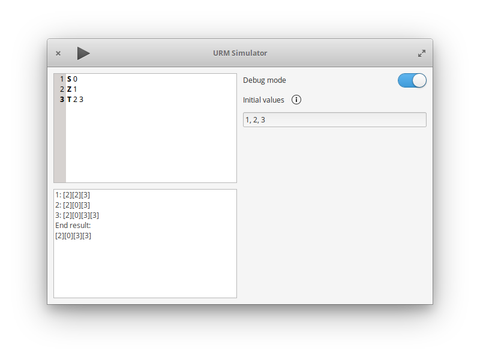

# urmsimulator
Exercise in Vala and publishing to elementary OS's AppCenter.

[](https://appcenter.elementary.io/com.github.aleksandar-stefanovic.urmsimulator)

> Notice: This project is stalled, because it has issues with Houston CI: Since it was originally pusblished, Houston CI rules have changed, which makes the current Houston CI tests fail either because there's a mismatch between the identificators of the current and the previous release, or because Houston CI doesn't allow the same identificators as the older releases, because they don't abide the rules which were changed since the original release.




## Current features
 - Executes URM code correctly
 - Ability to load a file
 - Ability to manually set initial values
 - Ability to set execution cap (to avoid infinite loops)
 - When in debug mode, shows the result after each instruction
 - Upon finishing, shows the state of all the used registers
 - Has basic sythax highlighting


## Planned features
 - Graph representation
 - Help and documentation
 - Saving files

## Dependencies

These are the required build dependencies:

```
gtk+-3.0
gtksourceview-3.0
```

## Building

Execute these commands in the root of the project:

```
mkdir build
cd build
cmake .. -DCMAKE_INSTALL_PREFIX=/usr
make
```


