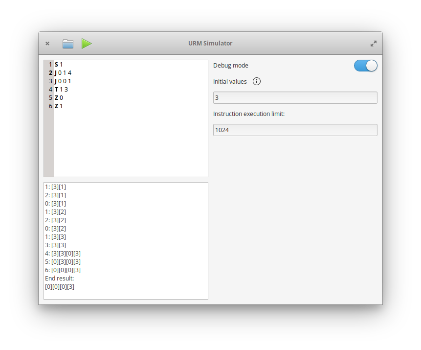

# urmsimulator
Exercise in Vala and publishing to elementary OS's AppCenter.



## Current features
 - Executes URM code correctly
  - Ability to manually set initial values
 - When in debug mode, shows the result after each instruction
 - Upon finishing, shows the state of all the used registers

## Planned features
 - Graph representation
 - Custom sythax highlighting.
 - Help and documentation.
 
## Note
At the time of writing, instructions are zero-based numbered, while the text widget shows line numbers with one-based numbering. This means that the line number is bigger by one than the number of the instrucion, i.e. if the line number is "4", the actual instruction number is "3". This will be fixed in the future.

## Dependencies

These are the required build dependencies:

```
gtk+-3.0
granite
gtksourceview-3.0
```

## Building

Execute these commands in the root of the project:

```
mkdir build
cd build
cmake .. -DCMAKE_INSTALL_PREFIX=/usr
make
```


